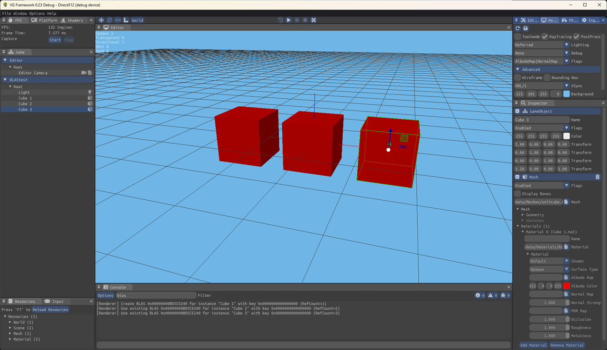
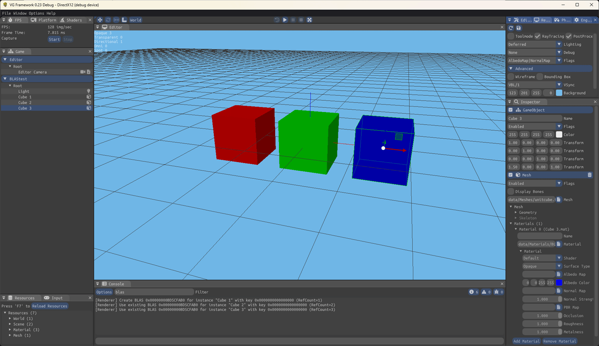
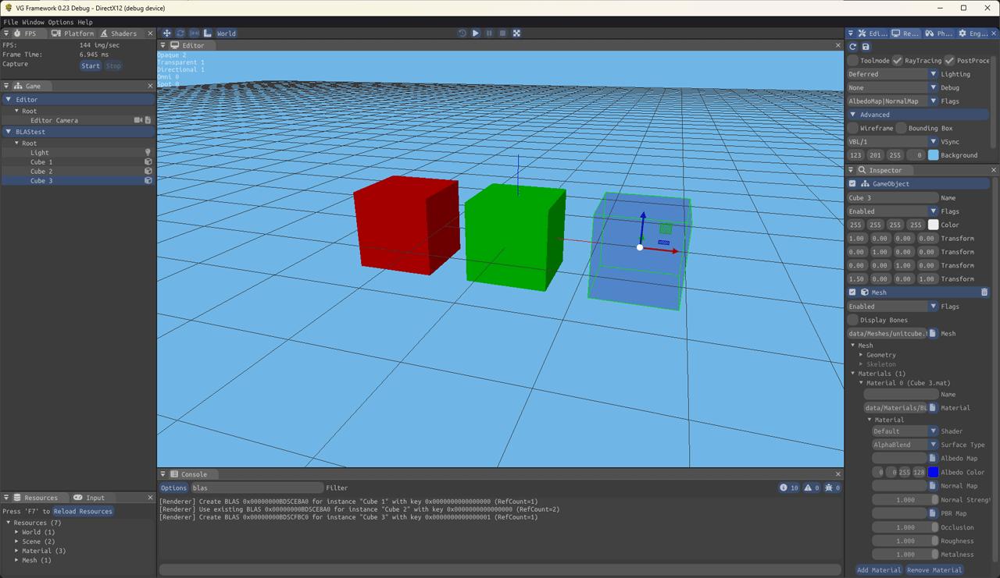

Strategy for building BLAS variants and updating BLASes.

# What's the deal with BLASes?

A BLAS is the local accelleration structures required for raytracing stuff using modern graphic APIs. 

Basically you will need BLASes that represent mesh instances in scene, and add them all to a TLAS.

It's easy to build a BLAS right after mesh loading, but still there a few things to consider :

- BLAS need to separate opaque vs. non-opaques batchs
- Dynamic geometry needs to update BLAS when it changes

# Opaque vs. non-opaque BLAS elements

When building BLAS right after loading a mesh, it would be convenient to know in advance which parts 
are using **alphablend** or **alphatest**, but it's also convenient to be able to use the same mesh 
with different material instances.

In [vgframework](https://github.com/vimontgames/vgframework), the mesh models are cooked without 
knowledge of the materials used and it's up to every **MeshModelInstance** can choose the materials to use.

A **MeshModel** holds a map of its different BLAses variants. A key is built from the materials used by the 
graphic instance so that the same configuration (e.g. Opaque/Opaque/Alphablend) return the same BLAS and 
increase its RefCount or create it when needed.

### Example

Three cubes using the same opaque material :

Three cubes using different opaque materials :

Three cubes using different materials but one is alphablend :

# Dynamic geometry

// TODO

